# 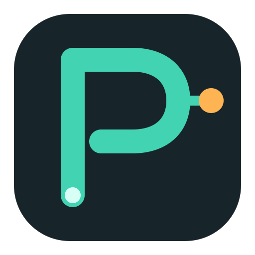 OpsPilot

> **인프라를 이해하고, 근본 원인�?찾아내고, 직접 고치�?운영 AI 에이전트 �?Slack�?Telegram에서 바로.**

*메트�?· 로그 · 트레이스 · 토폴로지 영향 범위 · 근본 원인 상관 분석 · 원격 실행 · 알림 기반 자동 조사 · 지식·코�?RAG 검�?· 전문 에이전트와 스킬.*

[](https://goreportcard.com/report/github.com/Zara1024/OpsPilot)
[](https://github.com/Zara1024/OpsPilot/releases/latest)
[](go.mod)
[](https://www.gnu.org/licenses/agpl-3.0.html)
[](#features)
[](CONTRIBUTING.md)
[](https://t.me/opspilotai)
[](https://join.slack.com/t/opspilot-co/shared_invite/zt-400skx7hz-WU1nmF1XVYH4S3Q1NfWrbw)

<p>
  <a href="https://trendshift.io/repositories/48061?utm_source=repository-badge&amp;utm_medium=badge&amp;utm_campaign=badge-repository-48061" target="_blank" rel="noopener noreferrer">
    
  </a>
</p>

[English](./README.md) | [简体中文](./README_ZH.md) | [日本語](./README_JA.md) | 한국�?| [Español](./README_ES.md) | [Français](./README_FR.md) | [Deutsch](./README_DE.md) | [Português](./README_PT.md) | [Русский](./README_RU.md)

---

<p align="center">
  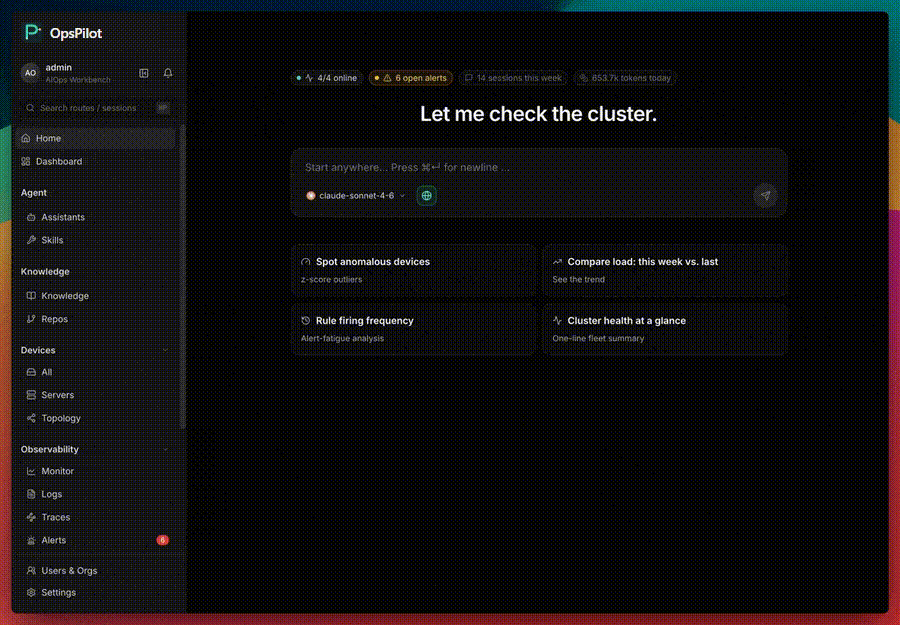
</p>

<p align="center">
  
  <br />
  <strong>☸️ Kubernetes 라이프사이클 관�?기능�?출시했습니다</strong><br />
  <sub>Edge�?클러스터�?등록하고, 워크로드와 이벤트를 확인하며, 업그레이드를 관리하�?Kubernetes 리소스를 토폴로지�?연결합니�?</sub>
</p>

<div align="center">

[기능](#기능) �?[설치](#설치) �?[연동](#연동) �?[라이선스](#라이선스)

</div>

## 기능

- 🤖 **Coordinator + Specialist 에이전트** �?coordinator가 SRE / 네트워크 / DB 서브 에이전트�?라우�?- 🚨 **알림 발생 �?자동 조사** �?investigator가 RCA worker 파견, 근본 원인�?채팅�?기록
- 🔍 **근본 원인 RCA** �?토폴로지�?영향 범위 분석, 메트�?로그/트레이스 상관, 소스 코드 라인까지
- 🔒 **인바운드 포트 0** �?edge가 외부�?발신, 호스트는 22 / 80 / 443 미오�?- 💻 **브라우저 SSH** �?역방�?터널�?대화형 �? �?/ 점프 호스�?불필�? 모든 명령 감사
- 🐳 **�?줄로 셀�?호스�?* �?`install.sh`으로 전체 스택 기동
- 📊 **가관측성 전체 스택 내장** �?Prometheus + Loki + Tempo + Grafana 자동 배포, Agent가 쿼리 작성
- 🧠 **원하�?모델 사용** �?Anthropic / OpenAI / GLM / DeepSeek / Gemini / Kimi, �?라우�?- 💬 **양방�?IM 채널** �?Slack / Telegram / Larksuite / DingTalk / WeCom, 채널�?로케�?- 🛠�?**읽기 전용 호스�?도구** �?bash 샌드박스 + 26+ 도구, 모든 호출 감사
- ☸️ **Kubernetes 라이프사이클 관�?* �?클러스터 등록, 워크로드와 이벤�?조회, 업그레이�?관�? Kubernetes 리소스를 토폴로지�?반영
- 🌐 **네트워크 장비 관�?* �?Edge 호스트에�?이웃�?발견하고 SNMP�?검�?�?인터페이스를 폴링하며 호스�?장비 연결�?표시

## 설치

서버 아키텍처(`linux-amd64` 또는 `linux-arm64`)�?맞는 최신 릴리스를 다운로드하고 압축�?�?다음 설치 스크립트�?실행하세�?(Ubuntu 22.04+, Debian 12+, RHEL/Rocky 9):

서버 아키텍처�?맞는 명령�?선택하세�?

**AMD64**
```bash
wget https://github.com/Zara1024/OpsPilot/releases/download/v1.1.1/opspilot-v1.1.1-linux-amd64.tar.xz
tar -xf opspilot-v1.1.1-linux-amd64.tar.xz && cd opspilot-v1.1.1-linux-amd64
sudo ./install.sh
```

**ARM64**
```bash
wget https://github.com/Zara1024/OpsPilot/releases/download/v1.1.1/opspilot-v1.1.1-linux-arm64.tar.xz
tar -xf opspilot-v1.1.1-linux-arm64.tar.xz && cd opspilot-v1.1.1-linux-arm64
sudo ./install.sh
```

**🇨🇳 중국 본토 사용�?* �?GitHub�?느리�?아키텍처�?맞는 CDN 미러 URL�?사용하세�?

```bash
# AMD64
wget https://mirror.ghproxy.com/https://github.com/Zara1024/OpsPilot/releases/download/v1.1.1/opspilot-v1.1.1-linux-amd64.tar.xz

# ARM64
wget https://mirror.ghproxy.com/https://github.com/Zara1024/OpsPilot/releases/download/v1.1.1/opspilot-v1.1.1-linux-arm64.tar.xz
```

## 제품 둘러보기

### 근본 원인 분석

<p align="center">
  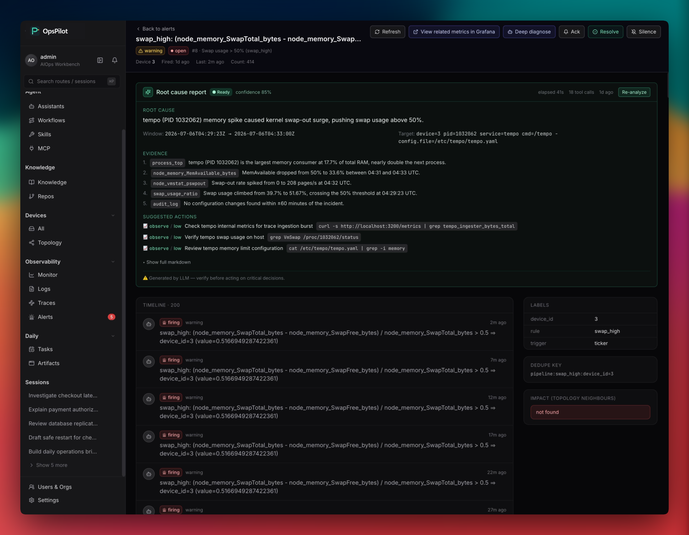
</p>

알림이나 운영 질문에서 시작�?토폴로지, 장비, 메트�? 로그, 변�?이력�?모아 근거 기반 분석�?만듭니다.

### 워크플로 빌더

<p align="center">
  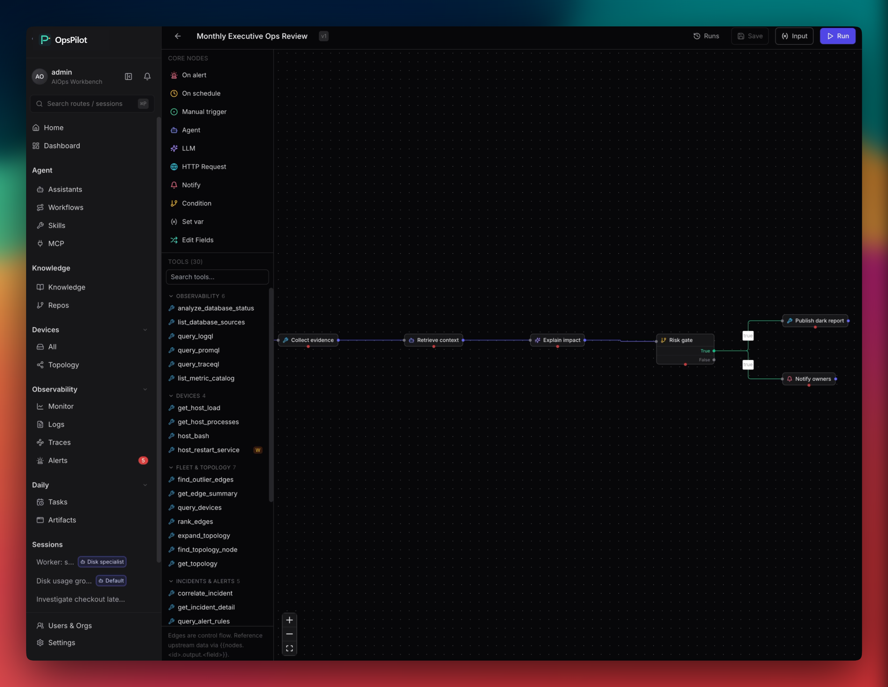
</p>

트리�? Agent, 도구, 조건, 알림�?재사�?가능한 자동화로 구성합니�?

### 스킬 카탈로그

<p align="center">
  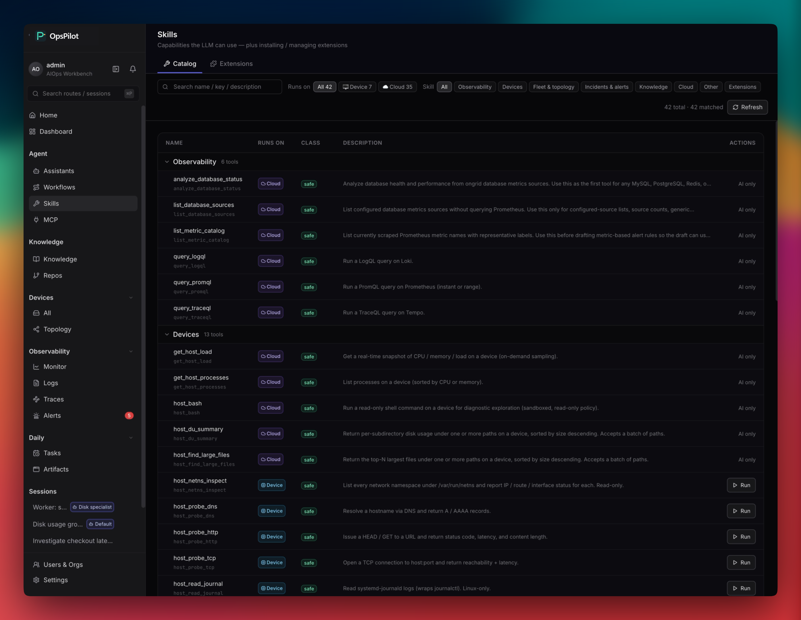
</p>

Agent가 호출�?�?있는 도구와 설명�?운영자가 �?�?있게 정리합니�?

### MCP 서버

<p align="center">
  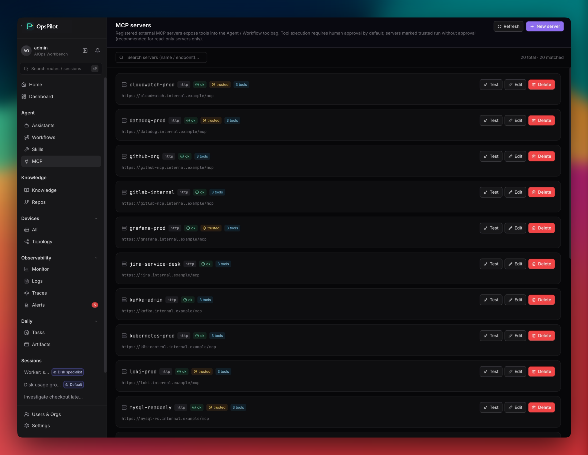
</p>

외부 MCP 서버�?등록�?도구�?동일�?관�?인벤토리�?연결합니�?

### 지�?저장소

<p align="center">
  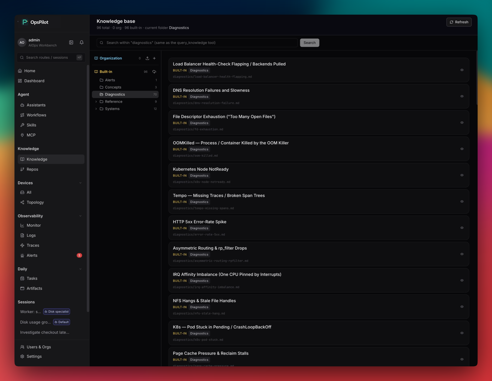
</p>

런북, 사고 이력, 아키텍처 노트, 저장소�?검�?가능한 운영 컨텍스트�?만듭니다.

### 아티팩트 센터

<p align="center">
  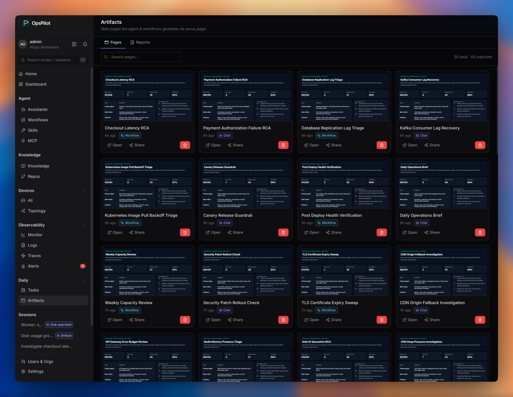
</p>

생성�?페이지와 보고서를 한곳�?보관�?검토와 인계�?사용합니�?

### 모니터링

<p align="center">
  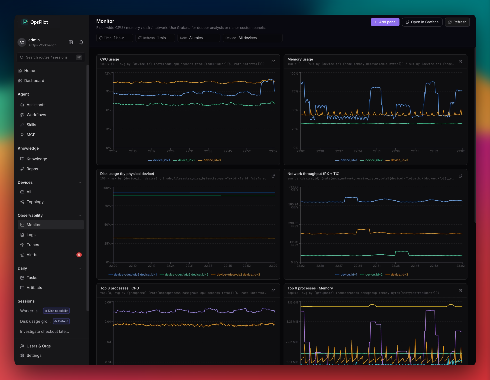
</p>

호스�?상태, 로그, 트레이스, 알림 상태�?같은 작업 공간에서 확인합니�?

### 토폴로지 �?
<p align="center">
  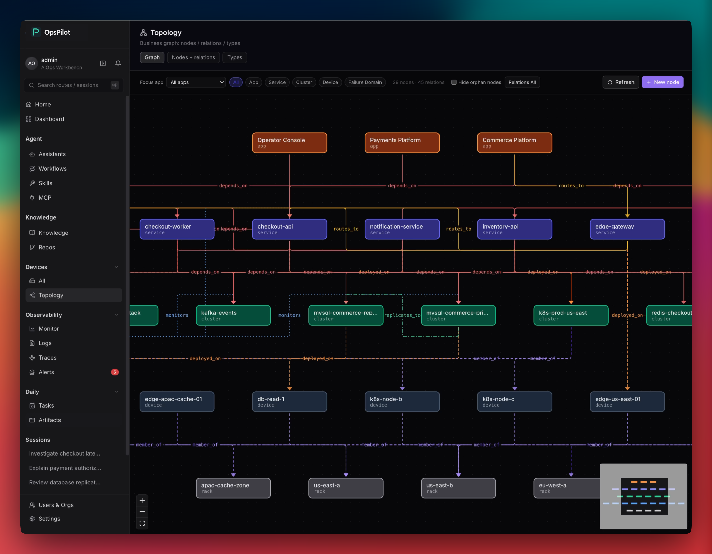
</p>

의존성과 영향 범위�?시각화해 장애 전파 경로�?추적합니�?

### 승인 �?쓰기 게이�?
<p align="center">
  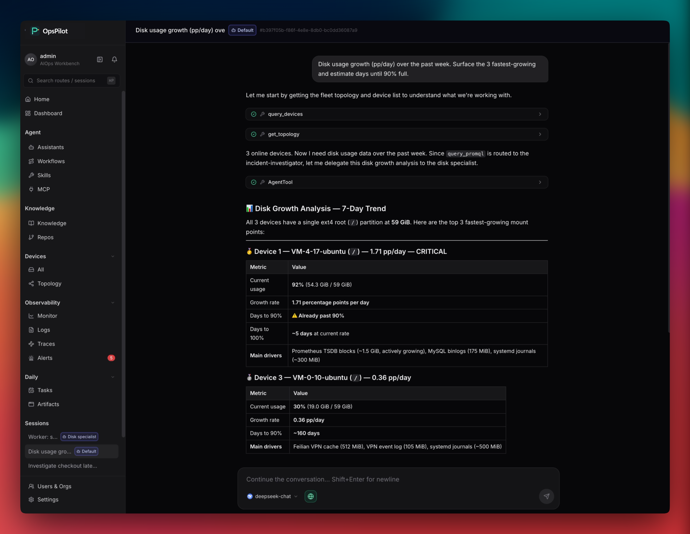
</p>

위험�?작업은 승인�?정책 경계 안에서만 진행합니�?

## 문서

전체 제품 문서�?[opspilot.cloud](https://opspilot.cloud/docs/get-started/introduction) �?있습니다.

| 영역 | 시작하기 |
|---|---|
| **시작하기** | [Introduction](https://opspilot.cloud/docs/get-started/introduction) · [Quickstart](https://opspilot.cloud/docs/get-started/quickstart) · [Architecture](https://opspilot.cloud/docs/get-started/architecture) · [Concepts](https://opspilot.cloud/docs/get-started/concepts) |
| **설치 �?운영** | [Server install](https://opspilot.cloud/docs/install/server) · [Edge install](https://opspilot.cloud/docs/install/edge) · [First boot](https://opspilot.cloud/docs/install/first-boot) · [Upgrade](https://opspilot.cloud/docs/install/upgrade) |
| **기능** | [Alerts](https://opspilot.cloud/docs/capabilities/alerts) · [RCA](https://opspilot.cloud/docs/capabilities/rca) · [Monitoring](https://opspilot.cloud/docs/capabilities/monitoring) · [Logs](https://opspilot.cloud/docs/capabilities/logs) · [Traces](https://opspilot.cloud/docs/capabilities/traces) · [Knowledge](https://opspilot.cloud/docs/capabilities/knowledge) · [Skills](https://opspilot.cloud/docs/capabilities/skills) |
| **Agent** | [Overview](https://opspilot.cloud/docs/agents/overview) · [Coordinator](https://opspilot.cloud/docs/agents/coordinator) · [Incident investigator](https://opspilot.cloud/docs/agents/incident-investigator) · [Specialists](https://opspilot.cloud/docs/agents/specialists) · [Reviewer](https://opspilot.cloud/docs/agents/reviewer) |
| **참조** | [API](https://opspilot.cloud/docs/reference/api) · [CLI](https://opspilot.cloud/docs/reference/cli) · [Alert rules](https://opspilot.cloud/docs/reference/alert-rules) · [Skill manifest](https://opspilot.cloud/docs/reference/skill-manifest) · [Data plane](https://opspilot.cloud/docs/reference/data-plane) |

## 연동

팀�?가관측성, 채널, 모델 스택�?그대�?연동됩니�?

| | |
|---|---|
| **가관측성** | &nbsp;&nbsp;&nbsp;&nbsp;&nbsp;&nbsp;&nbsp;&nbsp;&nbsp;&nbsp;&nbsp;&nbsp;&nbsp;&nbsp;&nbsp; |
| **채널** | &nbsp;&nbsp;&nbsp;&nbsp;&nbsp;&nbsp;&nbsp;&nbsp;&nbsp;&nbsp;&nbsp;&nbsp;&nbsp;&nbsp;&nbsp; |
| **모델** | &nbsp;&nbsp;&nbsp;&nbsp;&nbsp;&nbsp;&nbsp;&nbsp;&nbsp;&nbsp;&nbsp;&nbsp;&nbsp;&nbsp;&nbsp; |

## 라이선스

AGPLv3 �?[LICENSE](LICENSE) 참조.
